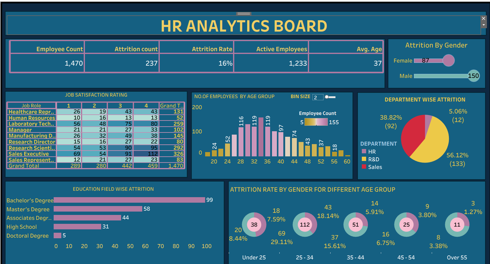

# 👩‍💼 HR Attrition Dashboard

An interactive **Tableau Dashboard** built to analyze and visualize **employee attrition patterns**.  
This dashboard helps organizations identify the key reasons behind employee turnover and design strategies for better retention and engagement.

---

## 🧭 Project Overview

The **HR Attrition Dashboard** provides actionable insights into workforce trends by analyzing:
- 📉 **Overall Attrition Rate** — Total attrition percentage and employee count.  
- 👥 **Attrition by Gender** — Compare male vs female attrition distribution.  
- 🏢 **Department-wise Attrition** — Identify departments with the highest employee turnover.  
- 💼 **Job Satisfaction Rating** — Understand employee satisfaction across job roles.  
- 🎓 **Education Field & Attrition** — Analyze attrition trends based on education level.  
- 📅 **Age Group Distribution** — Explore how age impacts attrition behavior.

This visualization enables HR professionals to make **data-driven decisions** for improving workplace stability and employee satisfaction.

---

## 🖼️ Dashboard Preview



> 💡 *Tip:* Store your dashboard image in a folder named `images` inside your repository and ensure the file name matches.

---

## ⚙️ Tools & Technologies Used

| Tool | Purpose |
|------|----------|
| **Tableau Desktop / Public** | Dashboard creation & visualization |
| **Excel / CSV Dataset** | Source data |
| **Tableau Prep (optional)** | Data cleaning and transformation |
| **Visualization Types** | KPIs, Pie Charts, Donut Charts, Bar Graphs, Histograms |

---

## 📈 Key Insights

- 💼 **Attrition Rate:** 16% overall — with **237 employees** leaving out of **1,470**.  
- 📊 **Top Department:** **Sales** has the highest attrition (56.12%).  
- 👩‍🎓 **Education Insight:** **Bachelor’s Degree** holders show the highest attrition rate (99 employees).  
- 👥 **Gender Breakdown:** **150 males** and **87 females** left the company.  
- ⏳ **Age Factor:** Most attrition occurs between **25–34 years** age group.  
- 💡 **Actionable Takeaway:** Increase retention efforts for young professionals and address salary & satisfaction concerns in Sales.

---

## 🧑‍💻 About Me

👋 Hi, I’m **Pallavi M. Pawar**, an aspiring **Data Analyst** passionate about transforming raw data into meaningful business insights.  
I specialize in **Tableau, Python, SQL, and Excel**, with a focus on visual storytelling and dashboard creation.

🔗 **Connect with me:**
- 🌐 [GitHub](https://github.com/pallavipawar1805)
- 💼 [LinkedIn](https://linkedin.com/in/pallavi-pawar-3204572a1)
- ✉️ [Email Me](mailto:pallavikatkar181996@gmail.com)

---

## 📜 License

This project is licensed under the **MIT License** — feel free to use, modify, and share it.

```text
MIT License

Copyright (c) 2025 Pallavi M. Pawar

Permission is hereby granted, free of charge, to any person obtaining a copy
of this software and associated documentation files (the "Software"), to deal
in the Software without restriction, including without limitation the rights
to use, copy, modify, merge, publish, distribute, sublicense, and/or sell
copies of the Software, and to permit persons to whom the Software is
furnished to do so, subject to the following conditions:

The above copyright notice and this permission notice shall be included in
all copies or substantial portions of the Software.

THE SOFTWARE IS PROVIDED "AS IS", WITHOUT WARRANTY OF ANY KIND, EXPRESS OR
IMPLIED, INCLUDING BUT NOT LIMITED TO THE WARRANTIES OF MERCHANTABILITY,
FITNESS FOR A PARTICULAR PURPOSE AND NONINFRINGEMENT. IN NO EVENT SHALL THE
AUTHORS OR COPYRIGHT HOLDERS BE LIABLE FOR ANY CLAIM, DAMAGES OR OTHER
LIABILITY, WHETHER IN AN ACTION OF CONTRACT, TORT OR OTHERWISE, ARISING FROM,
OUT OF OR IN CONNECTION WITH THE SOFTWARE OR THE USE OR OTHER DEALINGS IN
THE SOFTWARE.
```

---

⭐ **If you found this dashboard insightful, please give it a star!**  
Your support motivates me to create more impactful data-driven visualizations.
